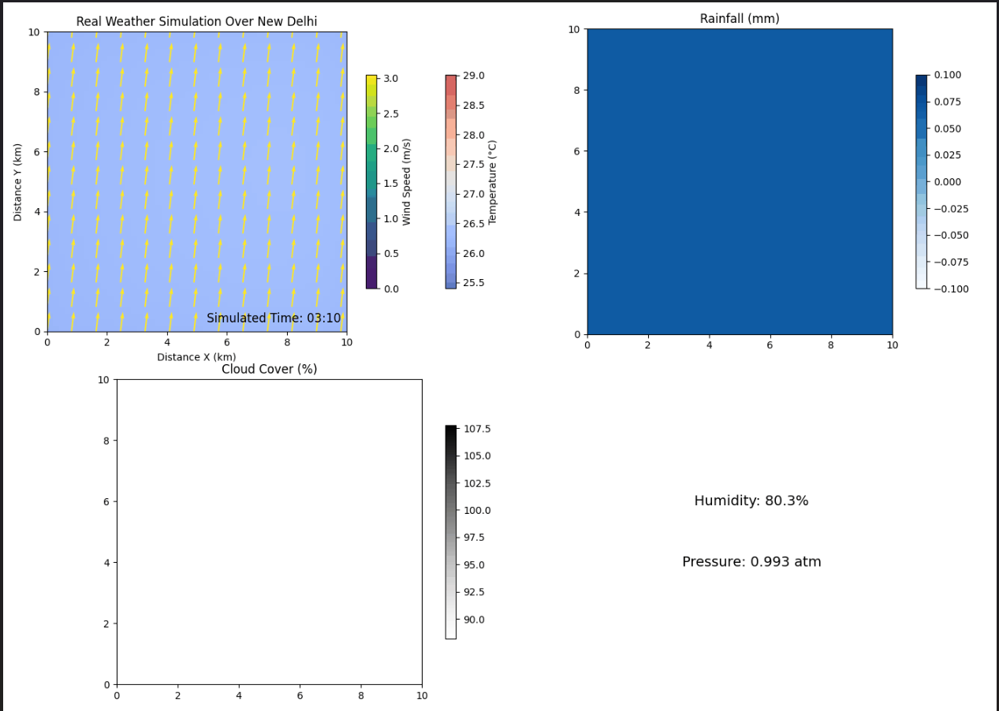

# 🌤 Real-Time Weather Simulation Over New Delhi

This project simulates weather dynamics over New Delhi using **live weather data from the Open-Meteo API**. It models temperature changes, wind behavior, cloud cover, and rainfall across a 10x10 km² grid and visualizes them in a real-time animation.

---

## 📁 File Structure

```
.
├── Project_file.py     # Main simulation script
├── output.gif / .mp4   # Exported animation (optional)
├── README.md           # Project overview
```

---

## 📌 Features

- 🔄 **Real-time API Integration**: Pulls hourly forecast from Open-Meteo
- 🌡 **Temperature Simulation**: Solves an advection-diffusion PDE
- 💨 **Wind Vector Field**: Based on live wind direction and speed
- 🌧 **Rainfall and Cloud Cover**: Interpolated from hourly data
- 📉 **Dynamic Visualization**: 2x2 subplot grid (Temperature+Wind, Rainfall, Cloud Cover, Humidity/Pressure)
- 🎥 **Animation Export**: As GIF or MP4 using `matplotlib.animation`

---

## 🛠 Tools & Libraries

- Python 3.x  
- `numpy`  
- `matplotlib`  
- `scipy.ndimage`  
- `requests`  
- `PIL` or `ffmpeg` (for animation saving)

---

## 🧪 How It Works

- **Grid**: 50×50 grid over a 10×10 km² region of New Delhi
- **PDE Modeling**: Solves for temperature using a discretized advection-diffusion equation
- **Wind Influence**: Directional advection using real-time wind data
- **Rain/Cloud Integration**: Applied via external forcing terms
- **Smoothing**: Gaussian filtering to ensure stability

---

## 📊 Output Preview



Legend:  
- **Top Left**: Temperature + Wind vectors  
- **Top Right**: Rainfall (mm)  
- **Bottom Left**: Cloud Cover (%)  
- **Bottom Right**: Humidity and Pressure

---

## ▶️ Run the Simulation

Make sure all required libraries are installed:
```bash
pip install numpy matplotlib scipy requests
```

Then run:
```bash
python Project_file.py
```

To save the animation:
- Ensure `ffmpeg` is installed (for MP4) or `PIL` (for GIF)
- Uncomment the relevant export lines in the code

---

## 📈 Future Improvements

- Terrain-aware simulation  
- Higher resolution grids  
- Real-time dashboard using Dash or Streamlit  
- Incorporation of solar radiation and urban heat island effects

---

## 🤝 Credits

Developed by **Rajveer Tomar**  
Weather Data: [Open-Meteo.com](https://open-meteo.com)
